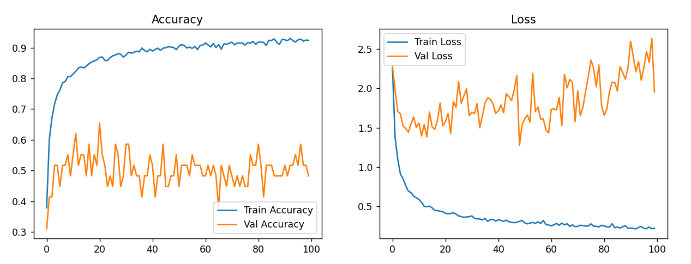
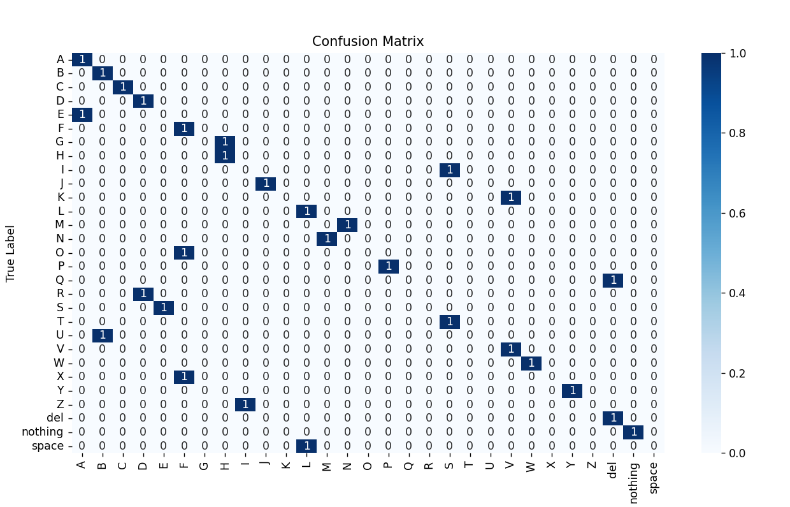
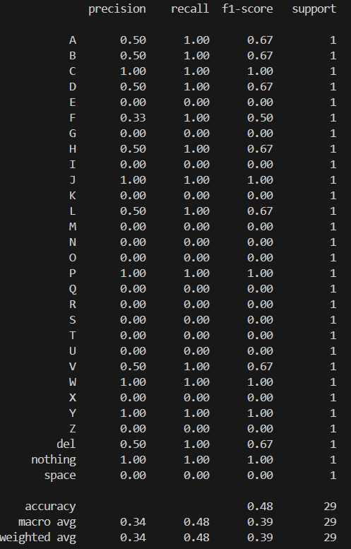
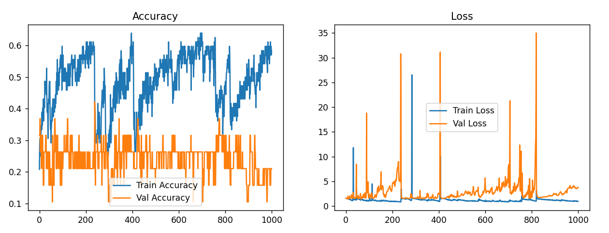
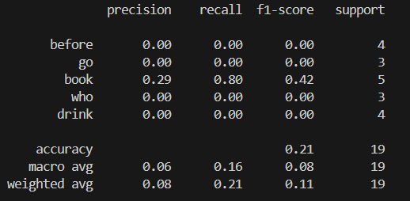

# Sign Language Detection

Comprehensive repo for static ASL alphabet classification and dynamic ASL word recognition trained during the internship project. This README collects results, assets (accuracy plots, classification reports, confusion matrices), and reproduction steps.

## Overview

This project supports two related tasks:
- Static classification: recognize ASL alphabet letters (A-Z, del, nothing, space) from images.
- Dynamic recognition: recognize selected ASL words from short video sequences using hand landmarks extracted with MediaPipe.

## Dataset

Details about the datasets used in this project (paths are relative to the repository root):

- Static (image) dataset
	- Location (local copy used here): `data/static/train/` (also a `data/static/test/` and `data/static/val/` may be present depending on your split).
	- Number of classes: 29 (A-Z plus `del`, `nothing`, `space`).
	- Example class size: class `A` contains 8,458 images (see `data/static/train/A/`).
	- Total images (train folder): 223,103 files under `data/static/train/` at the time of packaging.
	- Notes: images were resized to 128×128 and augmented for training (rotation, zoom, brightness). Class sizes are imbalanced; training used class-aware sampling / augmentation to reduce imbalance effects.

- Dynamic (video / landmark) dataset
	- Location (processed landmarks): `data/dynamic/processed_landmarks/` — each word has its own folder containing per-sample landmark sequences saved as .npy.
	- Number of target words (classes) in processed landmarks: 5 (examples present: `before`, `book`, `drink`, `go`, `who`).
	- Raw videos (if present): `data/dynamic/raw_videos/` — raw recordings used to produce landmark .npy files via `process_dynamic_data.py`.
	- Notes: landmarks were extracted using MediaPipe Hands and sequences were standardized/padded to 30 frames (resulting per-sample shape: (30, 126)).

If you want exact counts per-class for dynamic landmarks (number of .npy files per word) I can enumerate them and add a small table here.

## Assets

The repository contains visual assets summarizing training and evaluation results. These are referenced below and embedded where helpful.

- `assets/static_model_accuracy.png` — training / validation accuracy curve and final test accuracy for the static (MobileNetV2) model.
- `assets/static_model_confusionmatrix.png` — confusion matrix (static model) showing per-class errors.
- `assets/static_model_classificationreport.png` — precision / recall / f1 per-class for the static model.
- `assets/dynamic_model_accuracy.png` — training / validation accuracy curve and final test accuracy for the dynamic (LSTM) model.
- `assets/dynamic_model_classificationreport.png` — classification report for the dynamic model (per-word precision/recall/f1).

If you want to view these images in the repository, open the files above or view them on GitHub where they will be rendered inline.

## Method summary

- Static preprocessing: images resized to 128×128, normalized, and augmented (rotation, zoom, brightness).
- Static models: baseline 5-layer CNN; advanced: MobileNetV2 (pretrained, fine-tuned).
- Dynamic preprocessing: videos converted to sequences of MediaPipe hand landmarks (21 landmarks × 3 coords × hands => feature vector per frame). Sequences were standardized/padded to 30 frames producing shape (30, 126).
- Dynamic models: baseline Random Forest on aggregated features; advanced: stacked LSTM network trained on full sequences.

## Results

Summary of final evaluation metrics (test set unless otherwise noted):

### Static model results

- Baseline CNN: ~85% accuracy (validation/test baseline).
- MobileNetV2 (fine-tuned): ~98% accuracy.

Accuracy / training curves:



Confusion matrix (static model):



Classification report (precision / recall / f1 per class):



Notes:
- MobileNetV2 gives much better generalization due to pre-trained features and fine-tuning; most remaining errors are between visually-similar alphabet signs.

### Dynamic model results

- Random Forest (baseline on averaged landmarks): ~43% accuracy — poor because temporal dynamics are lost.
- LSTM (sequence model): ~92% accuracy — models the temporal aspect of gestures and captures motion patterns.

Training / evaluation curves:



Classification report (dynamic):



Notes:
- The LSTM clearly outperforms the RF baseline, confirming the importance of sequence modeling for dynamic gestures.
- If you need a confusion matrix for the dynamic model, run the evaluation script (see below) to generate and save `assets/dynamic_model_confusionmatrix.png`.

## Conclusion & interpretation

- Static classification: fine-tuning a pretrained CNN (MobileNetV2) is highly effective; expect ~98% accuracy on this dataset when trained with augmentation.
- Dynamic recognition: preserving temporal information (LSTM) drastically improves results vs. aggregated feature baselines (92% vs 43%).
- Practical recommendation: use MobileNetV2 for static tasks and an LSTM (or transformer/temporal CNN) for dynamic gestures. Add more words and augment motion examples to further improve robustness.

## Reproduce / Run locally

1. Create a virtual environment and install dependencies:

```powershell
python -m venv .venv
.\.venv\Scripts\activate
pip install -r requirements.txt
```

2. To train the static model:

```powershell
python train_model\train_static_model.py
```

3. To train the dynamic model:

```powershell
python train_model\train_dynamic_model.py
```

4. To process raw dynamic video data (landmark extraction):

```powershell
python process_dynamic_data.py
```

5. To run the demo app (Streamlit):

```powershell
streamlit run app.py
```

Model artifacts are stored under `models/` (e.g., `models/static_model.h5`, `models/dynamic_model.h5`). Evaluation images are stored in `assets/`.

## Project structure / relevant files

- `app.py` — demo app (Streamlit) for live/static inference.
- `process_dynamic_data.py` — data processing for dynamic videos (MediaPipe extraction).
- `train_model/train_static_model.py` — training script for static CNN / MobileNetV2.
- `train_model/train_dynamic_model.py` — training script for LSTM dynamic model.
- `models/` — saved model weights.
- `assets/` — accuracy plots, confusion matrices, classification reports (visual assets used in this README).
